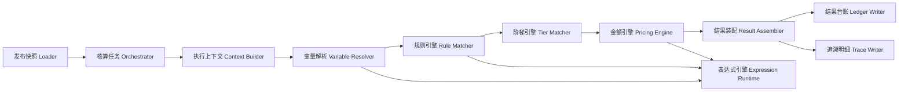
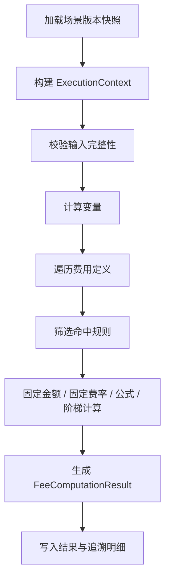

# 企业级核算引擎高级设计方案

更新时间：2026-03-30  
适用仓库：`D:/Desktop/cost_platform`  
设计定位：用于后续规则中心、阶梯规则、发布中心、试算中心、正式核算、结果追溯的统一技术底座。

## 1. 设计目标

本方案不是对 `charge` 老项目的平移，也不是对若干旧计费模块的简单拼接。
它吸收旧系统里已经被业务验证过的稳定思想，同时剔除那些会导致平台失控的历史包袱，最终形成一套适合当前新平台的企业级核算引擎方案。

目标如下：

1. 兼容多行业、多场景、多费用、多规则、多阶梯的统一核算模型。
2. 运行时严格基于场景发布快照执行，不直接依赖草稿配置。
3. 支持 `V.` 变量访问、`if/max/min` 等函数体系，以及“上下文驱动”的表达式计算。
4. 支持单笔试算、批量试算、正式核算、批量重算、结果追溯。
5. 支持可解释、可审计、可回放的运行链路。
6. 支持百万级月度核算的性能扩展，不在第一版把行业特例写死进核心服务。

## 2. 核心设计结论

### 2.1 吸收什么

从 `charge`、`formula`、`autoCalc` 一类系统中，明确吸收以下共性能力：

1. 表达式引擎必须支持自定义函数、编译缓存和上下文变量读取。
2. 变量、规则、阶梯、金额计算不能各自一套逻辑，应统一到同一条执行主链。
3. 每条待核算对象都必须构建独立的执行上下文，避免隐式全局状态。
4. 规则筛选、阶梯命中、金额计算、结果装配必须拆层，不能堆在一个大服务里。
5. 批量执行必须预装载快照与变量元数据，避免逐条重拼配置。

### 2.2 舍弃什么

以下做法在旧系统里常见，但不适合作为新平台内核：

1. 在核心服务里混入港口、薪资、仓储等行业特殊分支。
2. 让公式任意修改上下文中的任意字段，形成不可控副作用。
3. 让运行链直接绑定某个历史“合同/费率表”结构。
4. 把规则判断、数据查询、结果落库、日志打印、特殊业务补丁写进一个巨型类。
5. 让试算、正式核算、公用缓存和发布逻辑互相耦合。

一句话总结：新平台要做“稳定内核 + 行业可扩展壳层”，而不是“不断堆业务 if else 的超级服务类”。

## 3. 核算引擎总体架构



分层说明：

1. 发布快照 Loader：从场景版本快照中一次性装入费用、变量、规则、阶梯、字典、映射关系。
2. Orchestrator：控制任务级生命周期，如试算、正式核算、批量任务、幂等、分片并发。
3. Context Builder：为每条业务对象构建独立执行上下文。
4. Variable Resolver：按来源类型和依赖拓扑计算变量。
5. Rule Matcher：按费用逐一筛选命中规则。
6. Tier Matcher：对阶梯规则做区间命中或区段计算。
7. Pricing Engine：统一负责固定金额、固定费率、公式金额、阶梯金额等产出。
8. Result Assembler：整合费用结果、规则解释、变量解释、金额解释。
9. Ledger Writer / Trace Writer：分别写结果台账与追溯明细。

## 4. 统一对象模型

### 4.1 运行快照对象

运行时不直接使用草稿表，而使用场景发布快照反序列化出的只读对象：

1. `RuntimeSceneSnapshot`
2. `RuntimeFeeDefinition`
3. `RuntimeVariableDefinition`
4. `RuntimeRuleDefinition`
5. `RuntimeTierDefinition`
6. `RuntimeDictionaryDefinition`
7. `RuntimeRemoteMappingDefinition`

设计原则：

1. 快照对象是只读对象。
2. 快照对象结构服务运行，不强行等同数据库草稿表结构。
3. 快照对象内部建立索引，如按 `feeCode`、`variableCode`、`ruleCode` 的 map 索引。
4. 快照对象可序列化缓存到 Redis，但数据库仍然是最终依据。

### 4.2 执行上下文对象

每条业务对象构建一个 `ExecutionContext`，建议字段如下：

```java
public class ExecutionContext {
    private String taskId;
    private String taskType;
    private String sceneCode;
    private String sceneVersion;
    private String accountingPeriod;
    private String bizObjectId;
    private Map<String, Object> input;
    private Map<String, Object> context;
    private Map<String, Object> variableValues;
    private Map<String, FeeComputationResult> feeResults;
    private Map<String, Object> tempValues;
    private List<TraceStep> traceSteps;
}
```

语义说明：

1. `input`：原始入参数据，不建议被执行过程修改。
2. `context`：系统上下文，如组织、账期、任务来源、币种、版本、租户等。
3. `variableValues`：变量中心计算结果。
4. `feeResults`：已经完成的费用结果，可支持依赖其他费用结果的扩展场景。
5. `tempValues`：少量受控临时值，不开放任意写。
6. `traceSteps`：全过程追溯时间线。

### 4.3 费用结果对象

```java
public class FeeComputationResult {
    private String feeCode;
    private String feeName;
    private String ruleCode;
    private String ruleType;
    private String tierCode;
    private BigDecimal basisValue;
    private BigDecimal rateValue;
    private BigDecimal quantityValue;
    private BigDecimal amountValue;
    private String currencyCode;
    private String status;
    private String explainSummary;
}
```

## 5. 表达式引擎设计

### 5.1 为什么必须统一表达式引擎

如果变量公式、规则条件、金额公式分别用三套机制，后期一定会出现：

1. 语法不一致。
2. 函数能力不一致。
3. 调试和追溯口径不一致。
4. 版本升级成本翻倍。

因此新平台明确采用“统一表达式运行时”：

1. 变量公式使用它。
2. 规则条件表达式使用它。
3. 金额公式使用它。
4. 试算解释与正式核算追溯都使用同一解释器。

### 5.2 命名空间设计

保留 `charge` 用户习惯，同时做语义升级。

支持以下命名空间：

1. `V.xxx`
- 变量中心结果值。
- 示例：`V.workDays`、`V.goodsType`、`V.weightTon`

2. `C.xxx`
- 系统上下文值。
- 示例：`C.period`、`C.orgCode`、`C.sceneVersion`

3. `I.xxx`
- 原始输入对象字段。
- 示例：`I.customerType`、`I.contractNo`

4. `F.xxx`
- 当前已经生成的费用结果字段。
- 示例：`F.baseRent.amount`、`F.portCharge.amount`

5. `T.xxx`
- 当前规则临时计算量。
- 示例：`T.matchedRate`、`T.matchedTierMin`

命名空间原则：

1. `V` 是主要业务引用入口。
2. `I` 和 `C` 显式区分业务输入与系统上下文，避免混淆。
3. `F` 只允许在明确开启“费用间依赖”场景时使用。
4. 不建议让公式直接访问底层数据库字段名。

### 5.3 函数体系设计

首批函数建议内置如下：

1. 条件类
- `if(cond, a, b)`
- `caseWhen(cond1, value1, cond2, value2, defaultValue)`
- `coalesce(a, b, c)`

2. 数学类
- `max(a, b, ...)`
- `min(a, b, ...)`
- `abs(x)`
- `round(x, scale)`
- `ceil(x)`
- `floor(x)`
- `pow(a, b)`

3. 比较类
- `between(x, start, end)`
- `in(x, a, b, c)`
- `notIn(x, a, b, c)`
- `gt/ge/lt/le/eq/ne`

4. 字符类
- `contains(text, part)`
- `startsWith(text, prefix)`
- `endsWith(text, suffix)`
- `length(text)`
- `concat(a, b, ...)`

5. 日期类
- `dateDiff(unit, start, end)`
- `dateAdd(unit, base, amount)`
- `formatDate(date, pattern)`

6. 空值与转换类
- `isNull(x)`
- `isBlank(x)`
- `toNumber(x)`
- `toString(x)`
- `toDate(x, pattern)`

7. 集合类
- `sum(list)`
- `avg(list)`
- `count(list)`
- `distinctCount(list)`

8. 追溯增强类
- `trace(label, value)`
- `debug(label, value)`

设计原则：

1. 函数要“业务友好”，而不是只对开发友好。
2. 函数要尽量纯函数，不依赖外部可变状态。
3. 函数注册走 SPI 机制，后续新增行业函数无需修改核心引擎。
4. 尽量避免允许函数直接更新上下文主数据。

### 5.4 表达式安全与副作用约束

新平台不建议继续沿用旧项目“公式里直接写回任意变量”的模式。

推荐约束如下：

1. 表达式默认是纯读取表达式。
2. 变量公式的输出只能写入当前变量自身。
3. 金额公式只能输出约定字段，如 `amount`、`quantity`、`rate`、`basis`。
4. 若必须写临时值，仅允许写到 `T.` 受控空间。
5. 禁止表达式直接写 `I.`、`C.`、`V.` 的其他值。

这样做的收益：

1. 调试更清楚。
2. 追溯更可解释。
3. 公式执行不会偷偷污染后续链路。
4. 并行执行更安全。

## 6. 变量中心如何进入运行链

### 6.1 变量来源分类

基于当前平台详细设计，变量来源统一抽象为：

1. `INPUT`
- 从业务入参直接取值。

2. `DICT`
- 从业务字典/系统字典映射得出值。

3. `REMOTE`
- 从第三方系统或外部服务取值。

4. `FORMULA`
- 由表达式基于 `I/C/V/F` 派生。

5. `AGGREGATE`
- 对明细集合做聚合，作为增强扩展位保留。

### 6.2 变量求值顺序

变量计算不能简单按创建时间执行，应按依赖拓扑排序：

1. 先算 `INPUT`
2. 再算 `DICT`
3. 再算 `REMOTE`
4. 最后算 `FORMULA`
5. 其中 `FORMULA` 内部还要按依赖图拓扑排序

如果检测到循环依赖：

1. 试算时直接提示配置错误。
2. 发布校验时阻断发布。

### 6.3 第三方系统接入变量的高级做法

线程二已经落了轻量版入口，后续正式方案建议按以下模型推进：

1. `RemoteProvider`
- 定义某类外部系统接入能力，如 ERP、WMS、TMS、HR、IoT。

2. `RemoteRequestTemplate`
- 定义 URL、方法、鉴权方式、请求参数模板。

3. `RemoteFieldMapping`
- 定义远程字段到平台变量的映射。

4. `RemoteValueTransformer`
- 定义值转换、枚举映射、单位换算、空值兜底。

5. `RemoteCachePolicy`
- 定义缓存 key、TTL、是否允许账期级冻结缓存。

6. `RemoteFallbackPolicy`
- 定义失败重试、默认值、阻断策略、告警级别。

这部分不应写死在规则或公式里，而应成为变量中心的正式能力。

## 7. 规则中心内核设计

### 7.1 规则的本质

规则不是“某些条件和一个费率字段”的简单组合，而是费用取价策略的完整单元。

每条规则至少包含：

1. 归属费用
2. 生效状态
3. 优先级
4. 条件组
5. 计价类型
6. 计量基础
7. 结果输出方式
8. 阶梯配置引用
9. 解释模板

### 7.2 规则命中策略

建议引擎支持以下策略，但默认先落第一条：

1. `FIRST_MATCH`
- 按优先级排序，命中第一条即停止。

2. `MULTI_MATCH_SUM`
- 命中多条规则后累加金额。

3. `MULTI_MATCH_MAX`
- 命中多条规则后取最大金额。

4. `MULTI_MATCH_DETAIL`
- 命中多条规则，分别产出明细。

默认建议：

1. 大多数场景用 `FIRST_MATCH`
2. 薪资补贴、附加费、组合服务费可扩展 `MULTI_MATCH_*`

### 7.3 规则条件模型

建议条件模型支持“组 + 条件项”：

```text
Rule
  -> ConditionGroup(AND/OR)
      -> ConditionItem(variableCode, operator, compareValue, compareType)
```

支持的操作符建议：

1. `EQ`
2. `NE`
3. `GT`
4. `GE`
5. `LT`
6. `LE`
7. `IN`
8. `NOT_IN`
9. `BETWEEN`
10. `CONTAINS`
11. `PREFIX`
12. `IS_NULL`
13. `IS_NOT_NULL`
14. `EXPR`

其中：

1. 普通业务条件推荐走结构化条件项。
2. 复杂场景允许用 `EXPR` 走表达式。
3. 页面控件仍应由变量元数据驱动，不允许无边界自由输入。

### 7.4 规则优先级原则

建议优先级由以下几个维度共同决定：

1. 显式优先级字段
2. 条件精确度得分
3. 是否命中特定组织/账期/客户等高特异条件
4. 创建时间仅作最后兜底，不应成为核心优先级依据

旧系统里“谁条件多谁优先”的思路可以保留为辅助排序因子，但不应是唯一标准。

## 8. 阶梯引擎设计

### 8.1 为什么阶梯必须独立建模

阶梯不是规则附属的小数组，而是一种独立计价模式。
因为它天然需要解释：

1. 使用的是哪个依据变量
2. 当前变量值是多少
3. 落入哪个区间
4. 采用哪档费率
5. 是否按整段、分段、超额累进、超额递减来计算

### 8.2 阶梯模式建议

建议支持以下模式：

1. `SINGLE_SECTION`
- 变量值落在哪一档，就整单按该档费率计算。

2. `PROGRESSIVE`
- 分段累计。

3. `STEP_FIXED`
- 每档固定金额。

4. `STEP_RATE`
- 每档费率乘以档内计量值。

5. `CAPPED`
- 带封顶。

6. `FLOORED`
- 带保底。

### 8.3 阶梯解释输出

阶梯结果必须能形成业务可读解释，例如：

```text
依据变量：V.weightTon = 128
命中规则：RULE_PORT_WEIGHT_01
阶梯模式：分段累计
命中过程：
0-50 吨 * 8
50-100 吨 * 6
100-128 吨 * 5
最终金额：754
```

这也是后续试算和结果追溯的关键基础。

## 9. 核算主流程设计

### 9.1 单条业务对象执行流程



### 9.2 费用级计算顺序

建议费用执行顺序支持配置，但默认遵循：

1. 基础费用
2. 派生费用
3. 分摊费用
4. 汇总调整费用

这样为未来“费用依赖费用”的复杂模型预留空间。

### 9.3 正式核算与试算边界

试算与正式核算使用同一套内核，但输出目的不同：

1. 试算
- 允许更完整的调试信息。
- 允许返回变量过程、规则过程、公式明细。
- 不写正式结果台账，只写试算结果或临时表。

2. 正式核算
- 关注稳定性、幂等、性能和账期冻结。
- 写正式台账、审计记录、追溯索引。

## 10. 结果追溯与可解释设计

### 10.1 TraceStep 模型

建议统一建模为：

```java
public class TraceStep {
    private Integer stepNo;
    private String stepType;
    private String objectCode;
    private String objectName;
    private String expression;
    private String inputJson;
    private String outputJson;
    private String resultSummary;
    private String status;
    private Long elapsedMs;
}
```

### 10.2 追溯最少要能回答的问题

1. 本次用了哪个场景版本？
2. 某个费用为什么被计算？
3. 某个费用为什么没有命中？
4. 命中了哪条规则？
5. 条件里每个变量的值是多少？
6. 如果有阶梯，命中了哪档？
7. 如果有公式，公式输入是什么，输出是什么？
8. 最终金额是怎么来的？

这部分不是“锦上添花”，而是企业级平台能否落地的关键能力。

## 11. 性能与扩展设计

### 11.1 性能核心原则

1. 运行时只读快照，不反复拼草稿配置。
2. 表达式编译结果缓存。
3. 变量定义和规则定义按版本预装配。
4. 批量任务分片执行。
5. 远程变量查询支持批量化、缓存化、冻结化。
6. 结果台账与追溯明细分表。

### 11.2 幂等设计

正式核算必须按以下维度做幂等：

1. 任务号
2. 场景版本
3. 账期
4. 业务对象主键
5. 费用编码

必要时引入“结果覆盖策略”：

1. 不允许重复写入
2. 允许重算覆盖
3. 允许重算形成新批次版本

### 11.3 并行设计

建议并行粒度：

1. 任务级并行：多个分片任务并发
2. 对象级并行：多条业务对象并发执行
3. 变量级并行：仅对无依赖变量并行求值

不建议：

1. 在同一条对象的同一费用规则链上做过细并发
2. 在共享可变上下文上粗暴并发

## 12. 可扩展能力设计

### 12.1 SPI 扩展点

建议内核预留以下扩展接口：

1. `ExpressionFunctionProvider`
2. `VariableResolver`
3. `RemoteDataProvider`
4. `RuleMatchStrategy`
5. `TierPricingStrategy`
6. `AmountPostProcessor`
7. `TraceFormatter`

### 12.2 行业扩展策略

行业差异应放在配置、插件和扩展点中，而不是写进核心服务：

1. 港口行业：扩展港口专用变量解析器和函数包
2. 薪资行业：扩展班次、岗位、工龄等变量提供器
3. 仓储行业：扩展仓型、货类、周期规则函数
4. 运输行业：扩展线路、车型、里程、回空率等变量函数

核心引擎只负责调度，不负责知道“某个行业的吨公里如何补值”。

## 13. 推荐代码结构

建议后续真正实现时，按以下包结构推进：

```text
com.ruoyi.system.service.cost.engine
  |- orchestrator
  |- snapshot
  |- context
  |- variable
  |- expression
  |- rule
  |- tier
  |- pricing
  |- trace
  |- result
  |- remote
  |- spi
```

推荐核心类：

1. `CostCalculationOrchestrator`
2. `RuntimeSnapshotLoader`
3. `ExecutionContextFactory`
4. `VariableComputationEngine`
5. `ExpressionRuntime`
6. `RuleMatchEngine`
7. `TierPricingEngine`
8. `AmountCalculationEngine`
9. `TraceRecorder`
10. `ResultLedgerService`

## 14. 与当前线程边界的衔接

### 14.1 线程二已经具备的基础

当前线程二已经完成：

1. 费用中心
2. 变量中心
3. 第三方接入变量的轻量入口

这些功能为后续运行链提供了配置基础，但还没有进入真正的“规则运行引擎”阶段。

### 14.2 线程三到五如何落地本方案

1. 线程三
- 落 `ExpressionRuntime`
- 落 `RuleMatchEngine`
- 落 `TierPricingEngine`
- 打通规则中心、阶梯规则和公式构建器

2. 线程四
- 落 `RuntimeSnapshotLoader`
- 打通发布快照、版本台账、差异视图
- 确保运行链严格按快照执行

3. 线程五
- 落 `CostCalculationOrchestrator`
- 打通试算、正式核算、批量任务、结果台账、追溯解释

4. 线程六
- 上 Redis 快照缓存、远程变量缓存、任务并发优化、审计告警、重算治理

## 15. 最终建议

如果只用一句话描述这套新平台的计费核心思想，可以定义为：

“以场景发布快照为执行依据，以变量中心为数据入口，以规则和阶梯为决策核心，以统一表达式引擎为计算内核，以追溯台账为结果保障的企业级核算平台。”

这套方案相比传统计费模块的升级点在于：

1. 不再把计费理解成“找费率表然后套公式”。
2. 而是把它设计成“可治理、可发布、可运行、可解释、可扩展”的统一核算系统。

后续线程真正编码时，应优先以本方案为运行内核蓝图，再结合详细设计中的页面、表结构和治理口径逐步落地。
