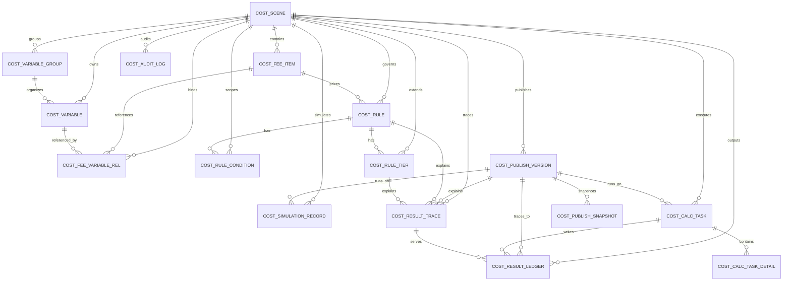

# 企业级核算平台 ER 图

## 1. 说明

本 ER 图对应 [企业级核算平台完整数据库设计.sql](D:/Desktop/cost_platform/企业级核算平台完整数据库设计.sql)，用于说明核算平台核心对象关系。

重点覆盖：

- 场景
- 费用
- 变量
- 规则
- 阶梯
- 发布版本
- 快照
- 核算任务
- 结果台账
- 追溯解释
- 审计日志

## 2. 核心 ER 图

## 3. 分层关系说明

### 3.1 配置层

配置层对象包括：

- `cost_scene`
- `cost_fee_item`
- `cost_variable_group`
- `cost_variable`
- `cost_fee_variable_rel`：费用输入契约，按 `source_type` 区分规则派生关系和人工维护关系
- `cost_rule`
- `cost_rule_condition`
- `cost_rule_tier`

这一层负责表达“怎么配”。

### 3.2 发布层

发布层对象包括：

- `cost_publish_version`
- `cost_publish_snapshot`

这一层负责表达“哪一版可运行”。

### 3.3 运行层

运行层对象包括：

- `cost_simulation_record`
- `cost_calc_task`
- `cost_calc_task_detail`

这一层负责表达“怎么跑”。

### 3.4 结果层

结果层对象包括：

- `cost_result_ledger`
- `cost_result_trace`

这一层负责表达“跑出来了什么”和“为什么这么算”。

### 3.5 治理层

治理层对象包括：

- `cost_audit_log`

这一层负责表达“谁改了什么、谁发布了什么、谁触发了什么”。

## 4. 关键关系说明

### 4.1 场景与费用

- 一个场景可以有多个费用
- 一个费用必须属于一个场景

### 4.2 费用与规则

- 一个费用可以有多条规则
- 同一个费用下，不同条件组合可对应不同规则

### 4.3 规则与阶梯

- 一条规则可以有多条阶梯明细
- 仅当规则类型为阶梯费率时使用

### 4.4 场景与发布版本

- 发布粒度为场景
- 一个场景可以发布多个版本
- 一个场景同一时刻只有一个当前生效版本

### 4.5 发布版本与快照

- 一个发布版本包含多条快照明细
- 快照对象覆盖场景、费用、变量、规则、条件、阶梯

### 4.6 任务与结果

- 一个正式核算任务可以产生多条任务明细
- 一个正式核算任务可以写入多条结果台账

### 4.7 结果与追溯

- 每条结果可以挂一条追溯解释
- 追溯解释中记录规则命中、阶梯命中、变量值与执行时间线

## 5. 高性能核算设计说明

针对“每月近 100 万条计费数据”，ER 设计上体现为：

- 任务主表与任务明细表分离
- 结果台账与结果追溯表分离
- 发布快照与运行明细分离
- 高频查询字段单独建索引
- 追溯说明用 JSON 单独承载，不污染主结果表

推荐重点索引关注：

- `scene_id + bill_month`
- `task_id + detail_status`
- `biz_no + fee_code`
- `scene_id + status`
- `scene_id + version_status`
