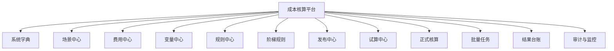
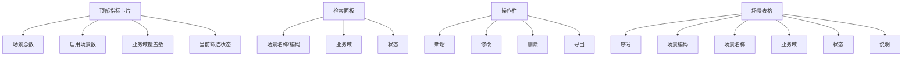
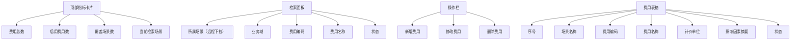
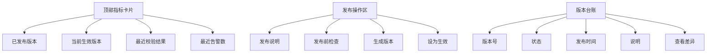

# 企业级核算平台详细设计

## 1. 文档目的

本设计用于指导 `cost_platform` 从底座到业务模块的完整建设。

目标不是做一组后台页面，而是做一套可以适应多行业、多公司、多合同、多费用类型的企业级核算平台。

本设计一旦确认，后续开发默认按照本文执行，避免产品概念、页面结构、数据建模和运行治理反复摇摆。

## 2. 产品目标

### 2.1 平台目标

平台需要同时满足以下目标：

- 支持多个业务域，例如薪资、劳务、港口作业、运输、仓储、材料、制造成本
- 支持多个场景，例如合同、方案、公司级核算域、结算主题
- 支持一个场景下多个费用项
- 支持一个费用下多条规则
- 支持固定费率、固定金额、公式、阶梯费率等多种计价方式
- 支持场景级发布与费用级追溯
- 支持试算、正式核算、批量任务、结果台账
- 支持审计、变更记录、引用校验、删除保护

### 2.2 核心原则

- 产品模型优先：先把对象和边界定义清楚，再做页面
- 业务维护优先：页面必须让业务人员能理解、能连续录入、能快速核对
- 治理能力优先：发布、引用、追溯、审计必须从第一版建模开始考虑
- 共性抽象优先：能共享的组件、样式、查询结构、字典能力必须共享

### 2.3 已验证参考基线

本平台的详细设计不仅基于抽象建模，也明确吸收 `charge` 最新成熟版本中已经被验证有效的能力与设计思想。

已确认应吸收的内容包括：

- 配置中心的场景级发布治理工作台
- 版本详情、版本差异对比、发布审计查询工作区
- 变量中心的公式构建器复用能力
- 费率规则页的费用主线工作台与复制并改条件值能力
- 类型化表单替代 JSON 直改的配置体验
- 试算执行步骤时间线与结果解释
- 结果台账独立页
- `docs/platform/产品计划清单.csv` 中已经验证有价值的阶段目标

因此，`cost_platform` 的最终建设要求是：

- 继承若依的规范化底座
- 继承 `charge` 已验证有效的成熟产品能力
- 在此基础上形成更通用、可跨行业复用的企业级核算平台

## 3. 核心对象模型

平台主线固定为：

`业务域 -> 场景 -> 费用 -> 变量 -> 规则 -> 阶梯 -> 发布版本 -> 核算执行 -> 结果追溯`

### 3.1 业务域

业务域是分类标签，不直接参与金额计算。

典型示例：

- 薪资核算
- 劳务结算
- 港口作业
- 仓储结算
- 运输计费
- 材料成本
- 制造成本

实现方式：

- 使用若依系统字典维护，字典类型建议为 `cost_business_domain`

### 3.2 场景

场景是平台第一层业务组织边界，可以理解为：

- 一个合同
- 一个核算主题
- 一个业务方案
- 一个公司级核算域

一个场景下可以配置：

- 多个费用
- 多个变量
- 多条规则
- 多个发布版本

### 3.3 费用

费用是场景下需要核算的具体费用项，例如：

- 底薪
- 夜班补贴
- 装卸作业费
- 管理费
- 材料损耗费

费用的作用：

- 给规则提供归属边界
- 形成结果输出的费目标识
- 成为费用级追溯的核心对象

### 3.4 变量

变量是核算使用的影响因素和中间量，可分为：

- 输入变量
- 字典型变量
- 接口型变量
- 公式变量
- 阶梯依据变量

变量可以服务于整个场景，也可以和特定费用建立适用关系。

### 3.5 规则

规则是费用取价和计算的核心单元。

规则至少回答以下问题：

- 这条费用在什么条件下命中
- 命中后取什么费率或金额
- 命中后是统一定价，还是按条件组合组取价
- 是否还有公式计算
- 是否存在优先级
- 是否使用阶梯

固定费率和固定金额规则必须同时支持两种定价模式：

- 统一定价：整条规则命中后取一个价格
- 组合定价：同一条规则可维护多个条件组合组，每个组合组绑定自己的价格，命中哪个组合组就取哪个组合组的价格

组合定价属于规则中心基线能力，不作为后续增强项单独讨论。核心目标是减少“仅因条件组合不同却被拆成多条规则”的规则爆炸问题。

### 3.6 阶梯

只有当规则计价方式为阶梯时，才维护阶梯明细。

阶梯费率不是抽象数字区间，而是受具体业务变量影响的费率模型。

典型示例：

- 船舶载重吨不同，对应不同费率
- 人员出勤人数不同，对应不同补贴标准
- 运输里程区间不同，对应不同单价
- 船长或艘次区间不同，对应不同港作费率

平台统一采用显式区间语义，避免边界歧义：

- 左闭右开：`100 <= x < 150`
- 左开右闭：`100 < x <= 150`

最终以场景级统一规则配置为准，不能让每条规则自由失控。

因此，阶梯设计必须满足：

- 阶梯依据变量必须显式化
- 阶梯依据变量必须来自变量中心，而不是页面手输字段
- 同一条阶梯规则要明确它比较的是哪一个业务变量
- 命中结果必须能解释成“某变量值落入某区间，因此取某档费率”
- 不同行业下的阶梯变量不能写死为某一个固定字段

### 3.7 发布版本

发布粒度为场景。

原因：

- 运行时依赖的是场景内整套配置快照
- 单独发布某个费用无法保证结果完全可复现
- 变量、规则、字典、公式往往是联动的

同时平台必须支持费用级追溯：

- 查看某个费用在某个版本中的规则快照
- 查看某个结果命中了哪条规则、哪一档阶梯、哪个变量

### 3.8 费用级版本视图

平台不支持“费用脱离场景独立发布”，但必须支持“费用级版本视图”。

原因：

- 费用规则依赖场景下的变量、字典、公式和发布快照
- 如果允许费用单独生效，会破坏场景版本的一致性
- 业务人员理解差异时，又天然是按某个费用来理解，而不是按整个场景理解

因此平台统一口径为：

- 生效粒度：场景版本
- 查看粒度：支持场景整体查看，也支持切换到费用维度查看

费用级版本视图至少要支持：

- 某费用在版本 V1 和 V2 之间的主数据差异
- 某费用下规则增删改差异
- 某费用下条件、阶梯、公式差异
- 某费用引用变量差异
- 某费用是否受到场景级变更连带影响

### 3.9 核算对象

成熟核算平台不能只描述“费用怎么算”，还必须描述“为谁算、按什么对象算”。

核算对象可以是：

- 员工
- 船舶
- 车次
- 箱次
- 合同单
- 客户
- 部门
- 班组

平台要求：

- 核算对象不能写死为某一个行业专属实体
- 场景需要能定义自己的核算对象维度
- 费用、规则、结果台账都要能挂接核算对象
- 导入、试算、正式核算都要明确本次数据对应的核算对象标识

### 3.10 账期

账期是成熟核算平台的核心治理对象之一，用于界定：

- 哪个账月/账期的数据正在核算
- 哪个账期已经结算完成
- 哪个账期允许重算
- 哪个版本对哪个账期生效

平台要求：

- 结果台账必须带账期
- 批量任务必须带账期
- 发布版本要能标识生效范围或默认生效账期
- 后续要支持账期封存、重算申请和差异分析

## 4. 用户角色设计

### 4.1 业务配置员

负责：

- 维护场景
- 维护费用
- 维护变量
- 维护规则与阶梯
- 发起发布

### 4.2 审核/治理人员

负责：

- 发布审核
- 差异核对
- 引用校验
- 删除审批
- 回滚和版本审计

### 4.3 核算执行人员

负责：

- 试算
- 正式核算
- 批量任务执行
- 结果核对

### 4.4 运维/管理人员

负责：

- 用户和权限
- 字典和接口来源
- 系统参数
- 监控和日志

### 4.5 权限矩阵原则

成熟核算平台不能只靠若依菜单权限，还必须定义业务动作权限。

至少要区分以下动作权限：

- 场景查看
- 场景维护
- 费用维护
- 变量维护
- 规则维护
- 阶梯维护
- 发布前检查
- 版本发布
- 生效切换
- 回滚
- 试算
- 正式核算
- 批量任务发起
- 重算申请
- 审计查看

后续开发时，每个页面按钮和接口都必须能映射到具体业务动作权限。

## 5. 功能模块设计

### 5.1 系统字典中心

定位：

- 承接基础下拉、业务分类、静态选项、部分接口映射字典

典型字典：

- 业务域
- 货种
- 内外贸
- 班次
- 工种
- 岗位
- 客户等级
- 币种
- 协力队
- 是否矿三

不进入字典的数据：

- 场景
- 费用
- 变量主数据
- 规则
- 阶梯

### 5.2 场景中心

定位：

- 维护场景主数据
- 作为费用、变量、规则、发布的上游边界

关键字段：

- 场景编码
- 场景名称
- 业务域
- 适用组织
- 状态
- 当前生效版本

工作台卡片建议：

- 场景总数
- 启用场景数
- 当前业务域覆盖数
- 当前筛选状态

说明：

- “已发布版本”“当前生效版本”这类卡片有参考价值，但应在发布中心恢复后再展示真实值，不能先伪造
- 发布中心恢复后，场景中心和配置中心工作台可补充：
  - 已发布版本数
  - 当前生效版本
  - 最近校验结果
  - 最近校验告警数

### 5.3 费用中心

定位：

- 对应老项目的基础费目维护
- 维护场景下所有费用主数据

关键字段：

- 所属场景
- 费用编码
- 费用名称
- 计价单位
- 影响因素摘要
- 适用范围说明
- 状态

工作台卡片建议：

- 费用总数
- 启用费用数
- 当前页覆盖场景数
- 当前检索场景

后续增强方向：

- 费用复制
- 费用与规则分栏联动工作台
- 费用影响因素摘要自动汇总
- 费用适用范围与业务对象标签

### 5.4 变量中心

定位：

- 维护场景下核算使用的变量
- 定义变量来源、类型、字典、接口、公式

变量类型：

- 文本
- 数值
- 字典下拉
- 接口下拉
- 布尔
- 日期
- 公式

变量来源：

- 手工输入
- 上游接口字段
- 第三方系统接口字段
- 第三方系统主数据或主档同步
- 字典选项
- 公式派生

变量关键能力：

- 引用关系查看
- 导入导出
- 变量分组
- 公式构建器
- 删除保护
- Excel 导入导出
- 导入预览与校验报告
- 变量复制
- 共享影响因素模板
- 第三方系统接入配置
- 接口鉴权与字段映射
- 同步失败重试与缓存兜底

变量中心必须支持多种接入模式：

- 字典接入
- 手工维护
- 第三方接口拉取
- 第三方主数据同步
- 批量导入
- 公式派生

对于第三方系统接入，平台必须考虑：

- 来源系统标识
- 接口地址、认证方式、密钥托管
- 字段映射与值转换规则
- 拉取方式（实时、准实时、定时同步）
- 调用失败后的兜底规则
- 接口结果缓存与刷新策略

### 5.5 规则中心

定位：

- 维护场景下某个费用的费率规则

规则维护主线：

- 先选场景
- 再选费用
- 再维护该费用下的规则

规则类型：

- 固定费率
- 固定金额
- 公式金额
- 阶梯费率

固定费率与固定金额的定价模式：

- 统一定价：规则命中后取单一费率或金额
- 组合定价：规则命中后继续按条件组合组取价；组合组内按 AND，组合组间固定按 OR 汇总

已验证必须吸收的规则中心能力：

- 费用主线工作台：先选费用，再维护该费用下规则
- 固定费率与固定金额的快速维护能力
- 固定费率与固定金额必须支持组合定价与按组变量，不允许退回原始 JSON 维护
- 阶梯费率的类型化表单维护能力
- 规则复制并改条件值
- 公式规则复用公式构建器
- 删除前实时预检查
- 停用前实时预检查

规则字段：

- 规则编码
- 所属费用
- 优先级
- 状态
- 规则类型
- 条件命中模式
- 定价方式（统一定价 / 组合定价）
- 组合组定价明细（命中组 -> 价格）
- 费率/公式/阶梯依据变量
- 适用说明

界面设计原则：

- 允许复制并改条件值
- 支持可编辑表格化维护
- 条件值控件由变量元数据驱动
- 组合定价时，组合组之间固定按“满足任一组即可”汇总，并显式维护每组价格
- 查询区、操作区、台账区、编辑区统一采用工作台式布局
- 主键不直接暴露给业务人员，优先展示序号和业务编码
- 操作列固定，优先使用框架原生能力

### 5.6 阶梯规则中心

定位：

- 维护某条规则下的阶梯费率明细

核心能力：

- 起始值
- 截止值
- 单价
- 边界类型
- 阶梯摘要
- 连续性校验
- 重叠校验
- 空区间校验
- 阶梯依据变量显式化
- 区间边界口径统一化
- 阶梯命中结果可解释

### 5.7 发布中心

定位：

- 统一处理场景级发布治理

能力范围：

- 发布前校验
- 生成发布版本
- 生效切换
- 回滚
- 差异对比
- 发布说明
- 快照留存
- 发布审计查询
- 发布资格提示
- 最近校验结果摘要
- 快照对象查看

工作台卡片建议：

- 场景总数
- 已发布版本数
- 当前生效版本
- 最近校验告警数

已验证需要纳入正式设计的发布治理工作区：

- 版本台账
- 版本详情工作区
- 版本差异比对工作区
- 发布前检查与阻断错误列表
- 生效切换与回滚入口

发布中心还必须支持费用级差异视图：

- 发布时汇总“本次影响费用清单”
- 版本详情中按费用筛选
- 版本差异中按费用切换查看
- 单费用差异摘要卡片
- 单费用规则变更明细

版本差异展示的层级统一为：

- 场景级总览差异
- 费用级差异摘要
- 规则级差异明细
- 阶梯/条件/变量引用细项差异

### 5.8 试算中心

定位：

- 验证配置结果，不入正式台账

关键能力：

- 输入变量样例
- 命中规则解释
- 阶梯命中解释
- 公式执行结果
- 单价来源说明
- 执行步骤时间线
- 输入、变量、规则、金额、结果的串联解释

### 5.9 正式核算/批量任务

定位：

- 负责正式执行

能力范围：

- 单笔核算
- 批量核算
- 任务管理
- 失败重试
- 任务明细
- 结果导出

必须吸收的稳定性要求：

- 单笔试算按发布快照执行
- 正式核算按发布快照执行
- 批量试算按发布快照执行
- 批量正式核算按发布快照执行
- 批量失败重试场景可回归验证

### 5.10 结果台账与追溯

定位：

- 给业务、财务、管理层解释结果

追溯粒度：

- 场景版本
- 费用
- 规则
- 阶梯
- 输入变量
- 公式

必须支持：

- 某结果用了哪个版本
- 某费用命中了哪条规则
- 某规则用了哪些条件
- 某阶梯为何命中
- 结果台账独立页
- 分页查询
- 详情回放

### 5.11 数据接入与导入中心

定位：

- 管理核算平台的数据进入方式
- 承接手工导入、接口装载、批量校验和导入预览

必须支持：

- 数据源类型定义
- 字段映射配置
- 导入模板下载
- 导入预览
- 错误报告
- 导入批次台账
- 导入幂等控制
- 第三方系统连接配置
- 接口鉴权管理
- 同步任务与同步日志
- 接口失败重试与告警

说明：

- 这是支撑多行业、多来源接数的关键模块，不能把导入逻辑散落在各个页面里

### 5.12 账期与重算治理

定位：

- 统一管理账期状态、重算申请、差异比对和历史结果稳定性

必须支持：

- 账期列表
- 账期状态切换
- 账期封存
- 重算申请
- 重算记录
- 重算前后差异分析
- 调账或补差结果记录

## 6. 关键业务流程

### 6.1 配置流程

1. 维护业务域字典
2. 维护场景
3. 维护费用
4. 维护变量
5. 维护规则
6. 维护阶梯
7. 进行试算
8. 通过发布校验
9. 发布版本

### 6.2 发布流程

1. 选择场景
2. 执行发布校验
3. 收集阻断错误与提示告警
4. 填写发布说明
5. 生成发布版本
6. 建立快照
7. 设为生效或待生效

### 6.3 核算流程

1. 选择场景或合同
2. 装载生效版本
3. 输入或导入业务数据
4. 计算变量
5. 命中规则
6. 命中阶梯或公式
7. 生成费用结果
8. 写入台账

### 6.4 变更流程

1. 在草稿上调整变量/规则/阶梯
2. 查看差异
3. 试算核对
4. 发布新版本
5. 旧版本保留可追溯

### 6.5 费用变更与场景发布交互流程

1. 业务人员在某个场景下维护一个或多个费用
2. 费用主数据、规则、阶梯、变量引用等改动全部进入场景草稿
3. 发布前校验时，系统自动识别本次被影响的费用清单
4. 发布说明页展示：
   - 本次变更费用数量
   - 被影响费用名称列表
   - 每个费用的差异摘要
5. 发布生成的是新的场景版本，而不是费用版本
6. 版本详情页允许按费用筛选查看本次变更
7. 结果追溯时，先锁定场景版本，再下钻到费用、规则、阶梯

### 6.6 数据导入与核算启动流程

1. 选择场景、账期和数据来源
2. 装载字段映射或导入模板
3. 执行导入预览与校验
4. 生成导入批次
5. 校验通过后发起试算或正式核算
6. 正式核算按发布快照执行
7. 核算结果写入台账并保留导入批次关联关系

### 6.7 账期封存与重算流程

1. 选择账期和目标场景
2. 查看当前账期结果与所用版本
3. 发起重算申请或差异分析
4. 审核通过后重新执行
5. 输出差异报告
6. 如无问题，完成重算入账或补差记录
7. 对已确认账期执行封存，禁止无审批的重复覆盖

## 7. 页面原型结构

## 7.1 全局信息架构

### 7.1.1 统一工作台布局原则

核算模块页面统一采用已经在 `charge` 最新版本验证有效的工作台式结构：

- 顶部导语区
- 指标卡片区
- 检索面板区
- 操作工具区
- 台账区
- 详情/编辑/对比工作区

统一约束如下：

- 指标卡片只展示当前模块真实可计算的数据
- 尚未恢复的治理数据不能伪造展示
- 页面共享的卡片、检索区、操作条必须抽公共组件
- 样式优先复用统一工作台样式，避免页面各写一套

### 7.1.2 驾驶舱图表设计原则

驾驶舱可以参考成熟项目的统计图表能力，但必须遵循“真实、可解释、能指导动作”三项原则。

适合首页驾驶舱的图表包括：

- 核算任务趋势图
- 发布次数与告警趋势图
- 业务域/场景分布图
- 结果异常分布图
- 批量任务耗时分布图
- 重点费用金额结构图

当前如果真实数据尚未恢复，则首页先展示：

- 核心指标卡
- 治理说明卡
- 重点场景列表
- 实施路径

等发布、任务、结果数据链路恢复后，再逐步接入真实图表。

### 7.2 场景中心原型

### 7.3 费用中心原型

### 7.4 规则中心原型

### 7.5 发布中心原型

## 8. 技术架构设计

### 8.1 前端

建议基于若依 Vue3 继续建设。

前端分层：

- 通用工作台样式层
- 核算通用组件层
- 核算业务页面层

共享组件建议：

- 工作台导语卡
- 指标卡片条
- 检索面板
- 操作栏
- 场景远程下拉
- 变量条件编辑器
- 规则表格工作台
- 阶梯编辑器
- 发布差异查看器

### 8.2 后端

建议基于若依 SpringBoot3 继续建设。

后端分层：

- Controller：接口入口
- Service：业务流程
- Mapper：数据访问
- Domain：对象载体

后续可增加：

- CostVersionSnapshotAssembler
- CostRuleMatcher
- CostFormulaExecutor
- CostPublishValidator
- CostTraceExplainService

### 8.3 Redis 与缓存

Redis 在本平台中的定位是：

- 高频读加速
- 临时状态承载
- 发布与执行链路的分布式锁
- 幂等控制

必须遵循：

- Redis 不是事实来源
- 发布、生效、正式核算以数据库和快照为准
- 先定义缓存对象和 Key，再编码

详细规范见：

- `核算平台缓存设计与Redis规范.md`

## 9. 发布与删除治理设计

### 9.1 删除判断原则

不能按“是否发布过”粗暴判断。

必须按以下两层判断：

- 是否被当前草稿或规则引用
- 是否进入已发布生效版本

### 9.2 删除规则

- 未被引用：允许删除
- 被草稿引用：提示后阻止或引导处理
- 被已发布版本引用：阻止删除，并提示先发布解除引用的新版本

### 9.3 停用规则

停用和删除一样，也要受引用与版本边界控制。

### 9.4 费用级版本差异规则

费用级差异不是独立发布，而是场景版本差异的一个观察视角。

平台必须支持以下差异分类：

- 费用主数据差异
- 规则新增
- 规则删除
- 规则条件差异
- 固定费率/固定金额差异
- 公式差异
- 阶梯区间差异
- 阶梯依据变量差异
- 引用变量差异
- 状态与启停差异

差异输出形式至少包括：

- 差异摘要
- 结构化字段对比
- 规则明细对比
- 影响范围提示
- 是否影响运行结果的标记

### 9.5 账期冻结与版本生效规则

版本生效不仅要解决“现在用哪版”，还要解决“历史账期能不能被新版本覆盖”。

平台统一要求：

- 新版本默认只影响其生效后的账期
- 历史结果不能被静默覆盖
- 已封存账期不得直接重算
- 历史账期如需重算，必须有重算申请、审批和差异记录
- 结果台账必须显式记录所用场景版本、费用规则口径和账期

### 9.6 关键状态流转原则

为了避免后续页面和接口各自发明状态，平台先统一定义对象状态流转原则：

- 场景/费用/变量/规则
  - 草稿
  - 启用
  - 停用
  - 归档
- 发布版本
  - 草稿中
  - 校验通过
  - 已发布
  - 已生效
  - 已回滚
  - 历史版本
- 核算任务
  - 待执行
  - 执行中
  - 部分失败
  - 执行成功
  - 执行失败
  - 已取消
- 账期
  - 未开始
  - 进行中
  - 已结算
  - 已封存

后续数据库字段、前端状态字典、按钮显隐、流程校验都必须围绕这套状态机展开。

## 10. 跨行业适配设计

平台适配不同行业，不靠改表结构，而靠以下能力组合：

- 业务域字典
- 场景主数据
- 变量元数据
- 规则条件编辑器
- 规则类型扩展
- 发布和追溯能力

示例：

- 薪资行业：变量偏工种、班次、岗位、工龄
- 港口行业：变量偏货种、内外贸、吨位、班次
- 仓储行业：变量偏仓型、计费周期、货类
- 运输行业：变量偏车型、路线、里程、载重

进一步要求：

- 同一行业可按公司拆场景
- 同一场景可承载多个费用
- 同一费用可按不同条件组合维护多条费率规则
- 同一平台必须兼容固定费率、公式金额、阶梯费率、分摊规则等多种模式

## 10.1 大数据量核算性能设计

平台必须按“每月近 100 万条计费数据”的规模提前设计，而不是等结果台账膨胀后再补救。

性能设计原则：

- 正式核算、批量任务必须异步执行
- 运行链必须按发布快照预装载，避免逐条重拼配置
- 结果台账与追溯明细分表设计，避免单表承担全部读写压力
- 高频查询必须围绕场景、月份、任务号、业务单号建立索引
- 列表查询必须分页，禁止全量加载
- 明细轨迹与解释信息单独存储，避免主结果表过宽

关键设计要求：

- 核算任务按批次或分片执行
- 结果表按 `bill_month`、`scene_id`、`task_no` 等维度建立组合索引
- 运行时快照允许进入 Redis 做装配缓存
- 正式核算结果写入采用批量写入策略
- 批量任务要支持失败重试和进度跟踪
- 试算与正式核算链路分开，避免试算流量污染正式结果表

推荐落地方式：

- 任务表与任务明细表分离
- 结果台账表与结果追溯表分离
- 后续根据数据量增长，可演进为按月分区或冷热分层

## 10.2 成熟平台补充能力清单

除了当前已经明确的主链能力，一个成熟的企业级核算平台还必须提前纳入以下设计范围：

- 组织、角色、数据权限与业务域权限联动
- 多租户或多公司隔离策略
- 账期管理与核算日历
- 外部数据源接入与字段映射治理
- 导入中心、导入批次、导入预览与错误报告
- 回归测试与规则验收样例库
- 规则影响分析
- 配置变更审批流
- 重算申请、重算记录与对账分析
- 结果归档与冷热分层
- 任务告警、失败订阅与通知中心
- 系统参数治理与阈值管理

这些能力不要求第一阶段全部实现，但必须在对象设计、数据库设计、页面入口和治理规则上预留扩展位。

## 11. 分阶段落地路线

### 第一阶段：配置主链重建

- 字典中心
- 场景中心
- 费用中心
- 变量中心
- 规则中心
- 阶梯规则

第一阶段成熟标准：

- 固定费率、固定金额、阶梯费率类型化表单完成
- 规则复制、费用主线工作台完成
- 列表分页、操作列固定、共享组件化完成
- 删除与停用前实时预检查完成

### 第二阶段：治理能力恢复

- 发布中心
- 版本台账
- 差异对比
- 删除保护
- 引用关系查看

第二阶段成熟标准：

- 场景级发布与费用级追溯同时成立
- 版本详情、版本差异、发布审计形成完整链路
- 发布资格、最近校验、快照对象、版本台账全部可用
- 配置变更审计日志与配置影响分析开始接入

### 第三阶段：运行链恢复

- 试算中心
- 正式核算
- 批量任务
- 结果台账
- 追溯解释

第三阶段成熟标准：

- 运行链全部按发布快照执行
- 执行步骤时间线可回放
- 单笔与批量任务分页、追溯、失败重试可用
- 台账独立页和差异解释报告可用

### 第四阶段：企业治理与平台化增强

- 权限治理
- 发布审批流
- 多租户与数据隔离
- 接口幂等与重复提交防护
- 重算对账与差异分析
- 配置影响分析
- 单点登录与组织同步
- 监控告警与链路追踪

### 11.1 来自 `charge` 清单的正式补充项

以下事项已经在 `charge` 清单中被证明有长期价值，应纳入 `cost_platform` 正式设计范围：

- 场景复制
- 变量复制
- 策略复制
- 核算对象维度建模
- 分摊规则建模
- 阶梯基准变量建模
- 共享影响因素模板化
- 配置维护权限
- 发布权限
- 正式核算执行权限
- 字段映射配置页
- 外部数据源适配页
- 中文文案统一治理
- 页面懒加载与按需加载治理
- 配置变更审计日志
- 发布审批流
- 多租户与数据隔离
- 接口幂等与重复提交防护
- 重算对账与差异分析
- 配置影响分析
- 单点登录与组织同步
- 监控告警与链路追踪

### 第五阶段：成熟运营与持续治理

- 费用级差异报告标准化
- 场景版本回归验证集
- 规则验收样例沉淀
- 账期封存与归档
- 数据冷热分层
- 首页真实图表驾驶舱
- 告警中心与通知联动

## 12. 执行要求

后续所有开发必须满足：

- 严格遵守若依项目规范
- 严格遵守 `核算模块开发规范.md`
- 严格遵守 `核算平台缓存设计与Redis规范.md`
- 严格遵守 `核算平台开发与验证规范.md`
- 严格遵守本详细设计

如果发生冲突，优先级如下：

1. 企业级核算产品模型正确
2. 业务维护路径易懂、易维护
3. 数据可发布、可追溯、可审计
4. 若依规范实现
