# 企业级核算平台页面原型设计

## 1. 文档目标

本设计用于把页面原型从“模块名列表”细化到“具体工作区结构”，确保后续开发时颗粒度一致。

页面原型统一遵循：

- 企业级深色工作台风格
- 顶部导语 + 指标卡片 + 检索面板 + 操作区 + 台账区 + 工作区
- 页面以业务对象主线组织，而不是以技术对象堆叠

## 2. 全局页面骨架

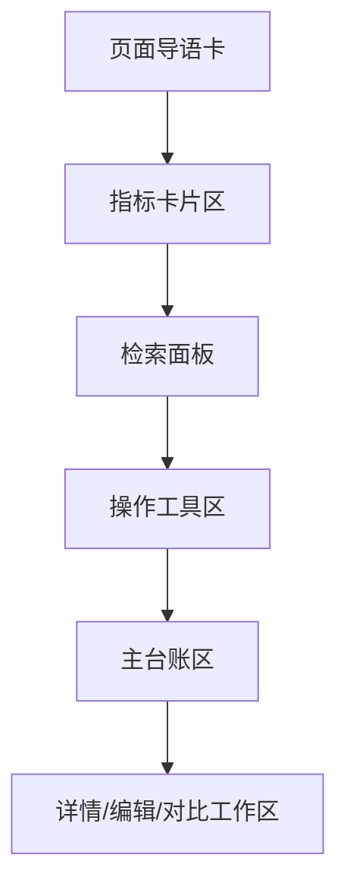

## 3. 首页驾驶舱原型

### 3.1 首页结构

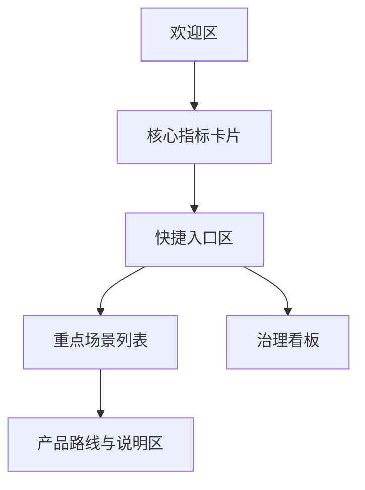

### 3.2 首页模块说明

- 欢迎区
  - 平台名称
  - 平台定位说明
  - 当前阶段标签
- 核心指标卡片
  - 场景总数
  - 启用场景
  - 费用总数
  - 启用费用
- 快捷入口区
  - 场景中心
  - 费用中心
  - 变量中心
  - 规则中心
  - 发布中心
  - 结果台账
- 重点场景列表
  - 显示重点场景名称、编码、业务域
- 治理看板
  - 当前已经完成什么
  - 当前待恢复什么
- 产品路线与说明区
  - 先配、再发、再跑、再追溯

### 3.3 首页按钮与交互

- 刷新首页
  - 重新拉取指标、重点场景、治理摘要与图表数据
- 快捷入口
  - 跳转到对应模块页面
- 指标卡片
  - 点击后进入对应模块并自动带默认筛选
- 重点场景列表
  - 点击进入该场景的工作台或场景详情
- 图表区域
  - 支持切换时间范围、业务域或场景范围

## 4. 场景中心原型

### 4.1 页面结构

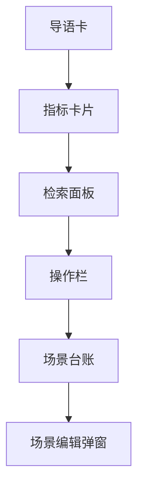

### 4.2 核心字段

- 场景编码
- 场景名称
- 业务域
- 状态
- 说明

### 4.3 指标卡片建议

- 场景总数
- 当前页启用场景数
- 当前页业务域覆盖数
- 当前筛选状态

### 4.4 按钮交互

- 搜索
  - 根据场景名称/编码、业务域、状态重新查询，并回到第一页
- 重置
  - 清空检索条件，恢复默认分页
- 新增
  - 打开场景新增弹窗
- 修改
  - 未选择时提示，单选后打开编辑弹窗
- 删除
  - 先走服务端引用与版本预检查
  - 如存在阻断原因，直接展示阻断明细
  - 如允许删除，再二次确认
- 导出
  - 按当前筛选条件导出场景台账
- 查看版本
  - 跳转或联动到该场景的发布中心

## 5. 费用中心原型

### 5.1 页面结构

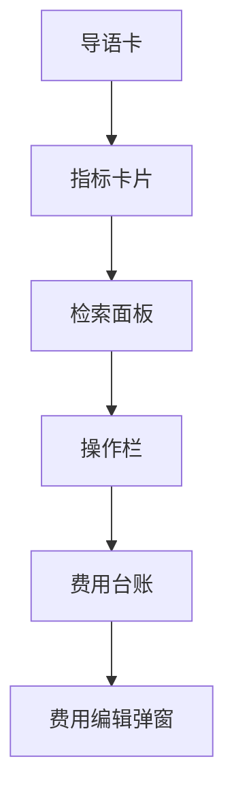

### 5.2 检索区要求

- 所属场景：远程下拉 + 模糊查询
- 业务域：字典下拉
- 费用编码
- 费用名称
- 状态

### 5.3 表格要求

- 主键不直接展示
- 左侧固定选择列和序号列
- 右侧固定操作列
- 操作列使用框架原生固定能力

### 5.4 按钮交互

- 搜索
  - 根据场景、业务域、费用编码、费用名称、状态查询
- 重置
  - 清空检索条件并重载列表
- 新增费用
  - 打开新增弹窗，默认要求先明确所属场景
- 修改费用
  - 未选择时提示，单选后打开编辑弹窗
- 删除费用
  - 先检查是否被规则、版本或结果引用
  - 命中阻断时展示原因与影响范围
- 导出
  - 导出当前费用台账
- 查看规则
  - 进入该费用对应的规则中心工作台

## 6. 变量中心原型

### 6.1 页面结构

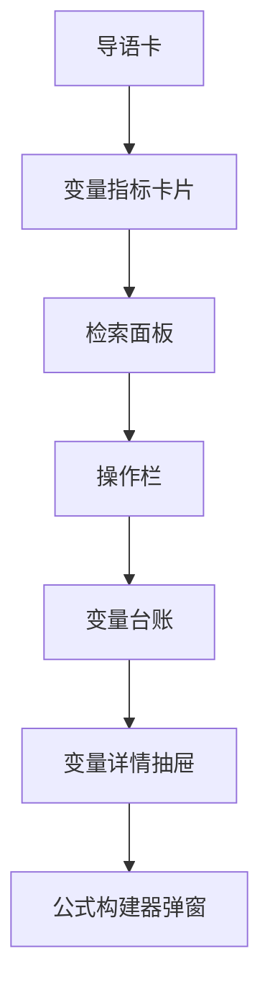

### 6.2 核心能力

- 变量分组
- 字典型变量
- 接口型变量
- 第三方系统接入变量
- 公式型变量
- 导入导出
- 导入预览与校验
- 引用关系查看

### 6.3 按钮交互

- 搜索
  - 按场景、变量编码、变量名称、变量类型、来源系统查询
- 重置
  - 清空检索条件并恢复默认分页
- 新增变量
  - 打开变量编辑抽屉
  - 先选择变量来源，再展示对应字段区域
- 修改变量
  - 未选择时提示，单选后进入编辑
- 删除变量
  - 先做引用和版本预检查，再决定是否允许删除
- 导入变量
  - 支持模板导入与导入预览
- 导出变量
  - 导出当前列表或筛选结果
- 配置公式
  - 打开公式构建器
- 测试第三方接口
  - 对当前接口配置执行连通性校验
- 预览第三方数据
  - 预览映射后的返回结果样例
- 刷新缓存
  - 刷新变量相关字典、接口结果缓存或同步状态

## 7. 规则中心原型

### 7.1 页面结构

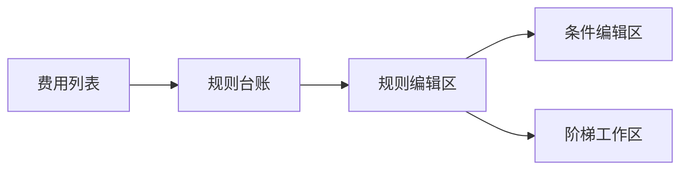

### 7.2 设计重点

- 先选费用，再维护该费用下规则
- 同一费用支持多条规则
- 支持复制并改条件值
- 固定费率和固定金额支持快速编辑
- 固定费率和固定金额必须支持“统一定价 / 组合定价”双模式
- 组合定价在同一规则内维护多个条件组合组和每组价格，不再靠拆多条规则兜底
- 公式和阶梯进入详细编辑

### 7.3 条件编辑区要求

- 条件值控件由变量类型驱动
- 字典型变量走字典下拉
- 接口型变量走远程下拉
- 数值变量走数值输入
- 组合定价时必须支持组合组概念：组内按 AND，组间固定按 OR
- 组合定价时必须在同一工作区维护“条件组合组 + 组价格”，而不是跳回 JSON 配置

### 7.4 阶梯工作区要求

- 显式维护阶梯依据变量
- 显式展示区间语义
- 校验空区间、断档、重叠
- 命中结果可解释

### 7.5 按钮交互

- 选择费用
  - 切换右侧规则台账与详情工作区
- 搜索规则
  - 按规则编码、状态、规则类型、条件摘要查询
- 新增规则
  - 基于当前费用新增规则
- 复制规则
  - 复制当前规则并保留条件结构、价格配置、优先级等
- 修改规则
  - 打开规则编辑区或详细抽屉
- 删除规则
  - 服务端预检查后再确认删除
- 快速保存
  - 对固定费率/固定金额等简单规则支持快捷保存
- 维护阶梯
  - 打开阶梯工作区或弹窗
- 查看影响范围
  - 查看该规则影响哪些版本、结果或费用解释

## 8. 发布中心原型

### 8.1 页面结构

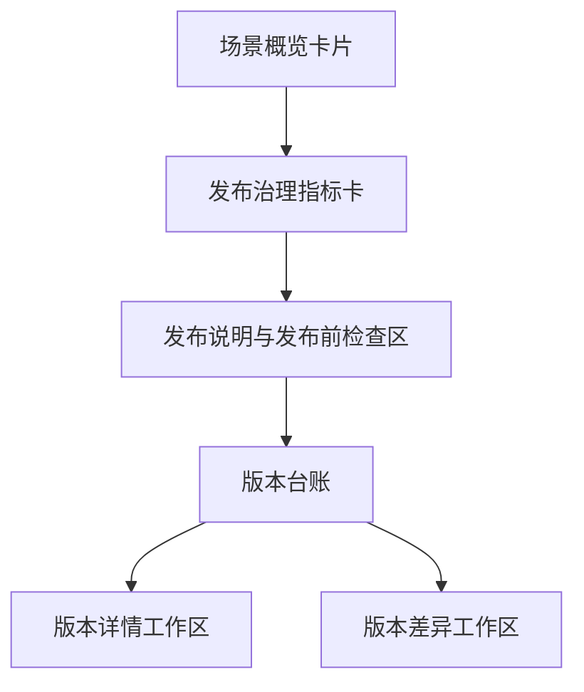

### 8.2 核心能力

- 发布前校验
- 发布说明
- 发布资格提示
- 版本台账
- 版本详情
- 版本差异对比
- 生效切换
- 回滚
- 发布审计查询

### 8.3 按钮交互

- 发布前检查
  - 执行场景完整性、引用关系、变量/规则/阶梯校验
- 查看阻断错误
  - 展示本次不能发布的原因清单
- 生成版本
  - 录入发布说明后生成新版本
- 设为生效
  - 将指定版本设为当前生效版本
- 查看差异
  - 默认展示场景级差异，可切换到费用级差异视图
- 按费用筛选
  - 只查看某个费用在不同版本间的差异
- 回滚
  - 将当前生效版本切回历史版本
- 查看快照对象
  - 查看本次发布固化了哪些费用、变量、规则和阶梯
- 发布审计查询
  - 查询谁在何时发布、回滚、生效切换

## 9. 试算中心原型

### 9.1 页面结构

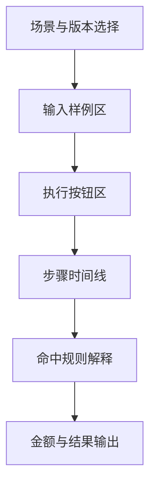

### 9.2 核心能力

- 输入示例装载
- 执行步骤时间线
- 单价来源说明
- 阶梯命中解释
- 规则命中解释
- 结果预览

### 9.3 按钮交互

- 装载示例
  - 装入默认样例数据或最近一次试算输入
- 清空输入
  - 清空当前输入区
- 执行试算
  - 按选定场景和版本执行试算
- 查看步骤
  - 展开执行步骤时间线
- 查看命中规则
  - 展示本次命中的费用、规则、条件和阶梯
- 导出试算结果
  - 导出本次试算结果和解释报告

## 10. 正式核算与批量任务原型

### 10.1 页面结构

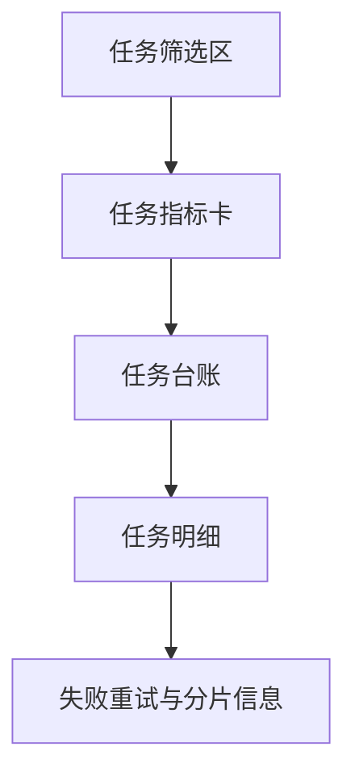

### 10.2 核心能力

- 单笔正式核算
- 批量任务发起
- 任务状态跟踪
- 明细分页
- 分片分页
- 失败重试

### 10.3 按钮交互

- 发起单笔核算
  - 按当前场景、账期、版本执行单笔正式核算
- 发起批量任务
  - 生成新的批量任务并进入排队执行
- 查看任务明细
  - 查看任务分片、处理进度、失败原因
- 失败重试
  - 对失败分片或失败明细执行重试
- 导出任务结果
  - 导出当前任务对应的结果清单
- 停止任务
  - 对可中止任务发起停止指令

## 11. 结果台账原型

### 11.1 页面结构

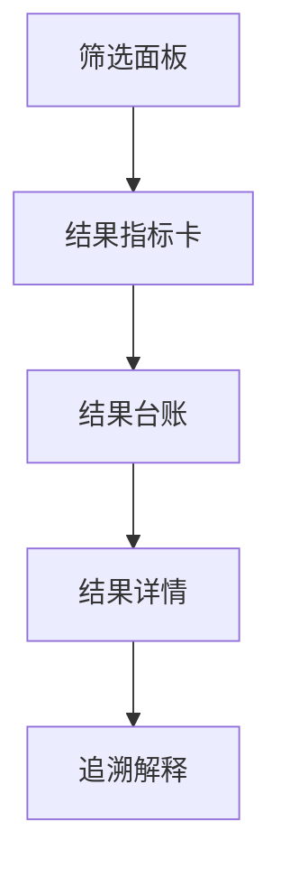

### 11.2 核心能力

- 按场景、账期、任务号、费用过滤
- 结果分页查询
- 结果详情查看
- 命中规则和阶梯回放
- 对账差异解释

### 11.3 按钮交互

- 搜索结果
  - 按场景、账期、任务号、费用、对象标识过滤
- 重置条件
  - 清空筛选条件并回到第一页
- 查看详情
  - 查看本条结果的金额、版本、来源任务
- 追溯解释
  - 展示命中规则、阶梯、变量、公式过程
- 导出结果
  - 导出当前筛选条件下的结果台账
- 差异对比
  - 对比不同版本、不同任务或不同重算结果

## 12. 审计与治理原型

### 12.1 页面结构

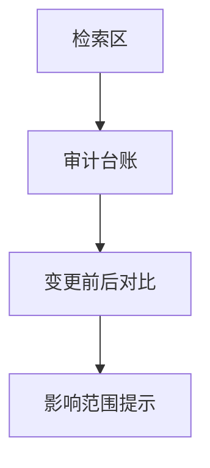

### 12.2 核心能力

- 配置变更审计日志
- 发布审计
- 删除阻断记录
- 停用阻断记录
- 高风险变更提示

### 12.3 按钮交互

- 搜索审计记录
  - 按对象、操作类型、人员、时间范围查询
- 查看前后对比
  - 展示对象变更前后差异
- 查看影响范围
  - 展示本次变更影响的场景、费用、规则或结果
- 导出审计记录
  - 导出当前审计台账

## 13. 数据接入与导入中心原型

### 13.1 页面结构

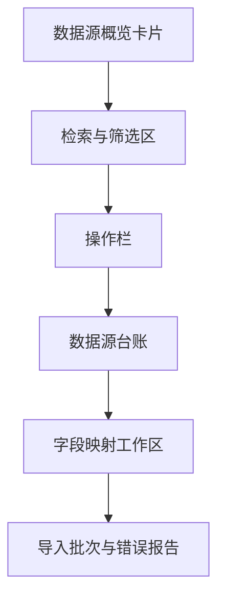

### 13.2 核心能力

- 第三方系统接入配置
- 接口鉴权管理
- 字段映射配置
- 导入模板下载
- 导入预览
- 导入批次台账
- 错误报告
- 同步日志

### 13.3 按钮交互

- 新增数据源
  - 新建第三方系统或导入来源配置
- 修改数据源
  - 维护接口地址、认证方式、字段映射等
- 测试连接
  - 校验第三方系统连通性和认证结果
- 同步预览
  - 预览返回样例和映射结果
- 保存映射
  - 保存字段映射和转换规则
- 发起导入
  - 生成新的导入批次
- 查看错误报告
  - 查看导入失败记录与错误原因
- 重试同步
  - 对失败批次或失败连接执行重试

## 14. 账期与重算治理原型

### 14.1 页面结构

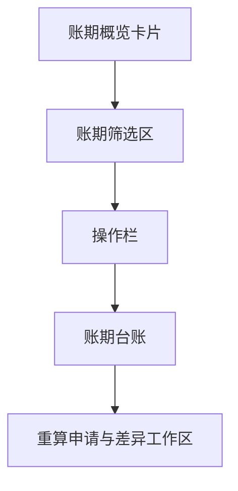

### 14.2 核心能力

- 账期状态管理
- 账期封存
- 重算申请
- 重算记录
- 差异分析
- 调账/补差记录

### 14.3 按钮交互

- 新建账期
  - 创建新的核算账期
- 封存账期
  - 将已确认账期设为封存状态
- 发起重算
  - 选择场景、账期、版本发起重算申请
- 审核重算
  - 审核通过后允许重算执行
- 查看差异
  - 比较重算前后结果差异
- 记录补差
  - 记录重算后的补差或调整结果
- 导出账期结果
  - 导出指定账期的结果和差异报告

## 15. 页面通用约束

所有核算页面都必须遵循：

- 主键不直接暴露给业务人员
- 列表优先显示序号和业务编码
- 操作列固定
- 检索区支持显示/隐藏，不破坏框架原生功能
- 检索区采用独立卡片包裹，颗粒度与工作台风格一致
- 共享样式、共享组件优先
- 不随意使用行内样式
- 不伪造指标数据
- 优先复用若依原生表格、分页、固定列、显隐检索能力
