# 企业级核算平台页面原型设计

## 1. 文档目标

本设计用于把页面原型从“模块名列表”细化到“具体工作区结构”，确保后续开发时颗粒度一致。

页面原型统一遵循：

- 企业级深色工作台风格
- 顶部导语 + 指标卡片 + 检索面板 + 操作区 + 台账区 + 工作区
- 页面以业务对象主线组织，而不是以技术对象堆叠

## 2. 全局页面骨架

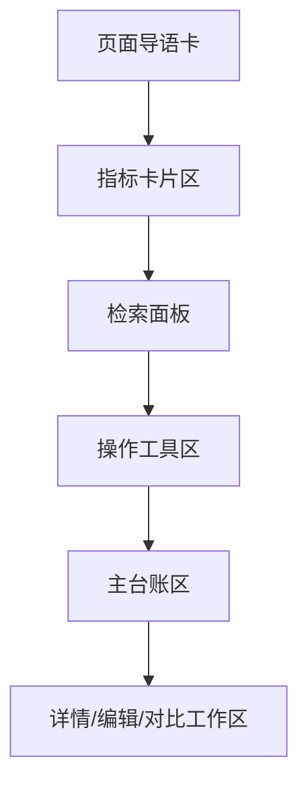

## 3. 首页驾驶舱原型

### 3.1 首页结构

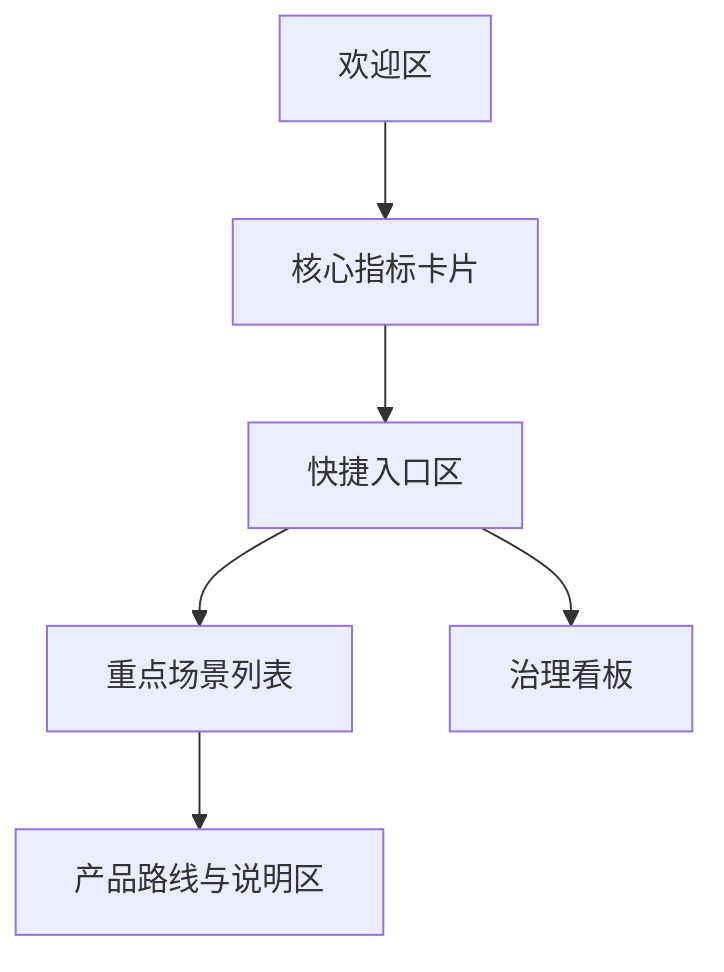

### 3.2 首页模块说明

- 欢迎区
  - 平台名称
  - 平台定位说明
  - 当前阶段标签
- 核心指标卡片
  - 场景总数
  - 启用场景
  - 费用总数
  - 启用费用
- 快捷入口区
  - 场景中心
  - 费用中心
  - 变量中心
  - 规则中心
  - 发布中心
  - 结果台账
- 重点场景列表
  - 显示重点场景名称、编码、业务域
- 治理看板
  - 当前已经完成什么
  - 当前待恢复什么
- 产品路线与说明区
  - 先配、再发、再跑、再追溯

## 4. 场景中心原型

### 4.1 页面结构

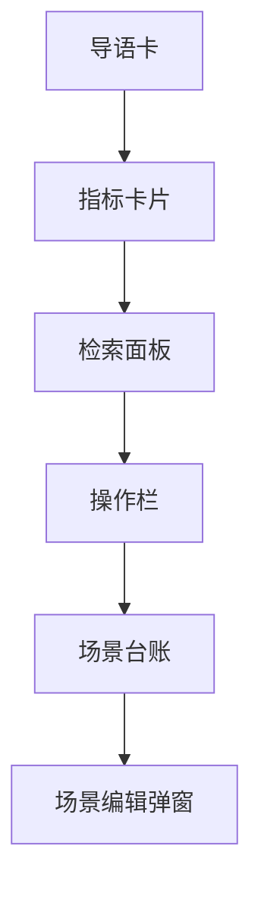

### 4.2 核心字段

- 场景编码
- 场景名称
- 业务域
- 状态
- 说明

### 4.3 指标卡片建议

- 场景总数
- 当前页启用场景数
- 当前页业务域覆盖数
- 当前筛选状态

## 5. 费用中心原型

### 5.1 页面结构

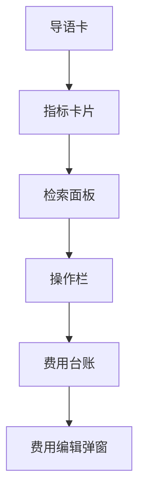

### 5.2 检索区要求

- 所属场景：远程下拉 + 模糊查询
- 业务域：字典下拉
- 费用编码
- 费用名称
- 状态

### 5.3 表格要求

- 主键不直接展示
- 左侧固定选择列和序号列
- 右侧固定操作列
- 操作列使用框架原生固定能力

## 6. 变量中心原型

### 6.1 页面结构

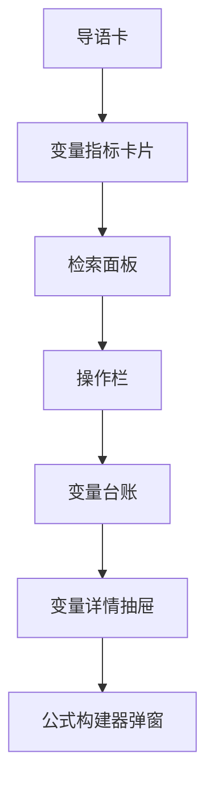

### 6.2 核心能力

- 变量分组
- 字典型变量
- 接口型变量
- 公式型变量
- 导入导出
- 导入预览与校验
- 引用关系查看

## 7. 规则中心原型

### 7.1 页面结构

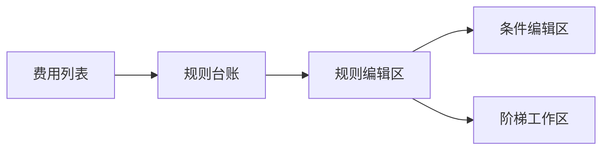

### 7.2 设计重点

- 先选费用，再维护该费用下规则
- 同一费用支持多条规则
- 支持复制并改条件值
- 固定费率和固定金额支持快速编辑
- 公式和阶梯进入详细编辑

### 7.3 条件编辑区要求

- 条件值控件由变量类型驱动
- 字典型变量走字典下拉
- 接口型变量走远程下拉
- 数值变量走数值输入

### 7.4 阶梯工作区要求

- 显式维护阶梯依据变量
- 显式展示区间语义
- 校验空区间、断档、重叠
- 命中结果可解释

## 8. 发布中心原型

### 8.1 页面结构

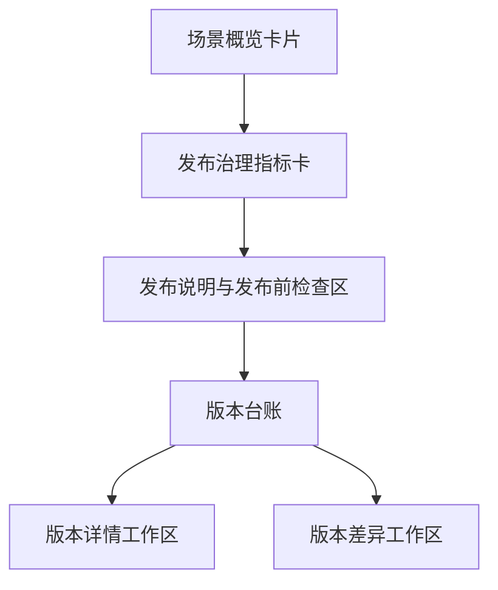

### 8.2 核心能力

- 发布前校验
- 发布说明
- 发布资格提示
- 版本台账
- 版本详情
- 版本差异对比
- 生效切换
- 回滚
- 发布审计查询

## 9. 试算中心原型

### 9.1 页面结构

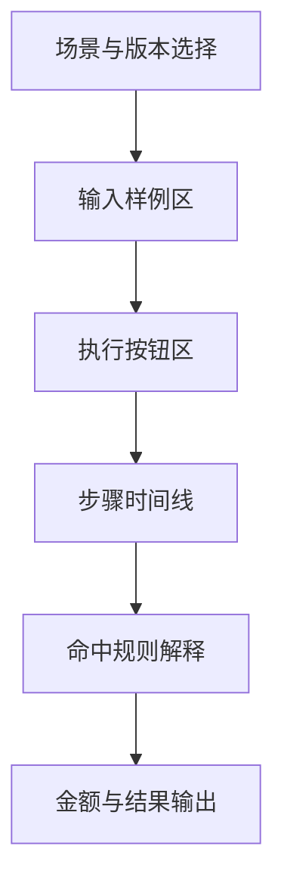

### 9.2 核心能力

- 输入示例装载
- 执行步骤时间线
- 单价来源说明
- 阶梯命中解释
- 规则命中解释
- 结果预览

## 10. 正式核算与批量任务原型

### 10.1 页面结构

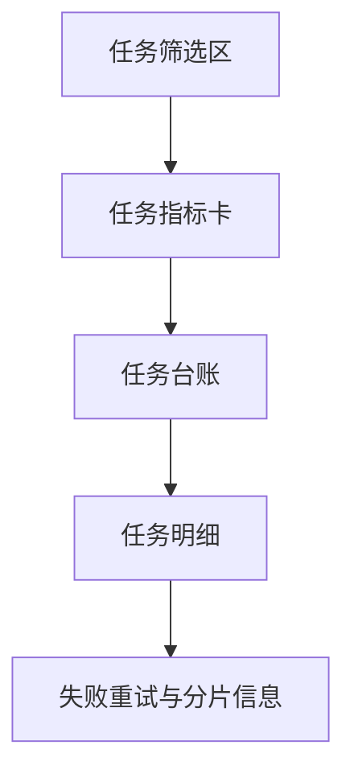

### 10.2 核心能力

- 单笔正式核算
- 批量任务发起
- 任务状态跟踪
- 明细分页
- 分片分页
- 失败重试

## 11. 结果台账原型

### 11.1 页面结构

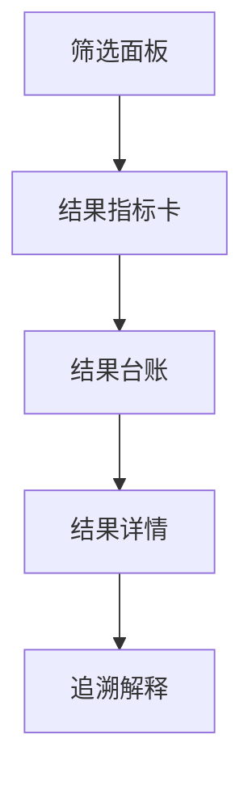

### 11.2 核心能力

- 按场景、账期、任务号、费用过滤
- 结果分页查询
- 结果详情查看
- 命中规则和阶梯回放
- 对账差异解释

## 12. 审计与治理原型

### 12.1 页面结构

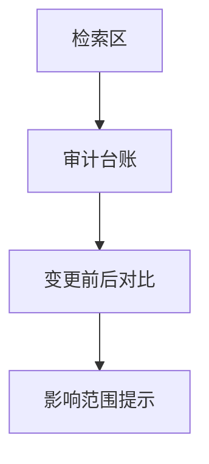

### 12.2 核心能力

- 配置变更审计日志
- 发布审计
- 删除阻断记录
- 停用阻断记录
- 高风险变更提示

## 13. 页面通用约束

所有核算页面都必须遵循：

- 主键不直接暴露给业务人员
- 列表优先显示序号和业务编码
- 操作列固定
- 检索区支持显示/隐藏，不破坏框架原生功能
- 共享样式、共享组件优先
- 不随意使用行内样式
- 不伪造指标数据
