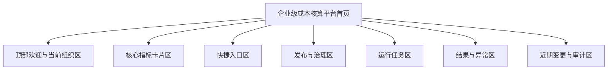
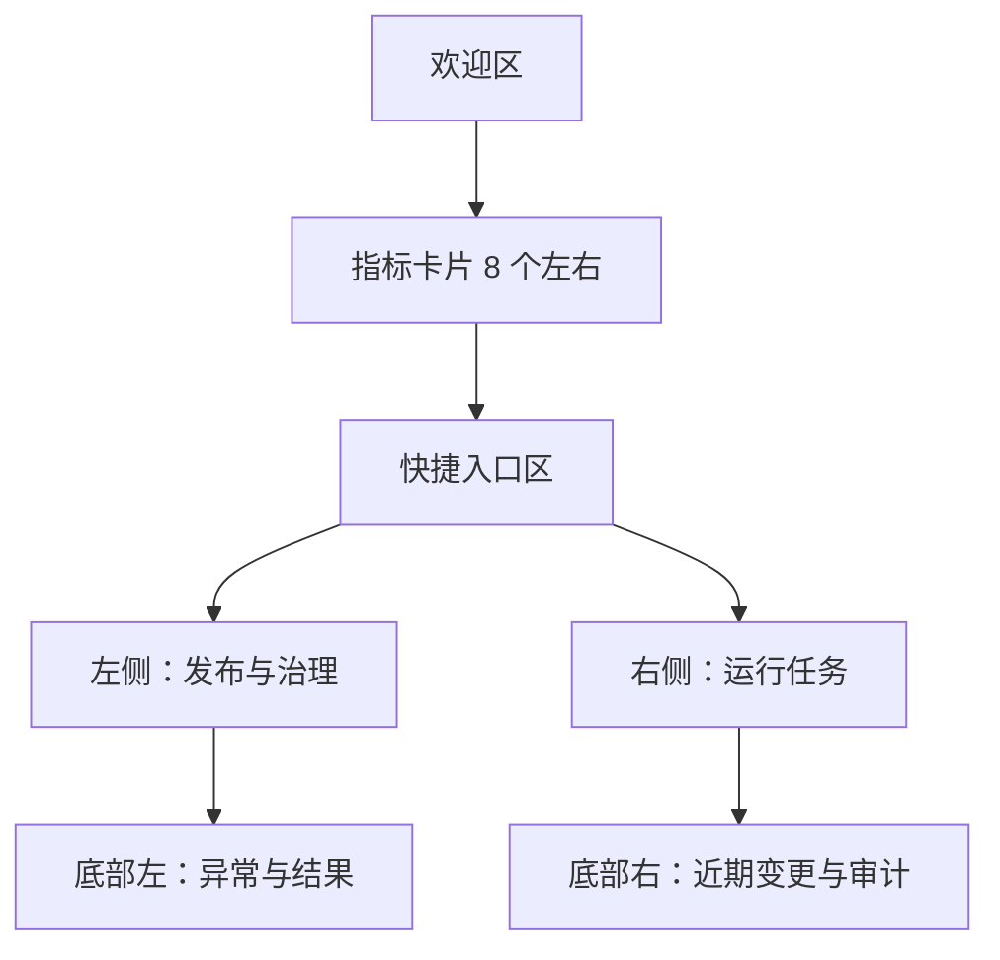

# 首页与底座裁剪设计

## 1. 文档目标

本设计用于指导 `cost_platform` 后续对若依底座进行业务化裁剪，并将首页改造成企业级成本核算平台首页。

本设计同时承担两个目的：

- 保留一份可回退的“重构底座基线”
- 明确哪些若依原生功能应保留、隐藏、替换或删除

## 2. 重构底座基线管理

后续在继续产品化改造前，必须保留一份“底座基线版本”。

这份基线版本的意义：

- 作为若依接入后的稳定起点
- 作为首页重做前的可回退锚点
- 作为后续裁剪和功能替换的比较基线

建议至少保留以下内容：

- Git 分支或标签
- 对应数据库初始化脚本版本
- 对应菜单与权限初始结构
- 对应首页和系统菜单的初始状态

## 3. 若依底座裁剪原则

### 3.1 保留的底座能力

以下能力应保留，作为平台治理底座：

- 登录认证
- 用户管理
- 角色管理
- 菜单管理
- 字典管理
- 参数配置
- 操作日志
- 登录日志
- 部门组织
- 通知公告

### 3.2 隐藏或删除的通用展示内容

以下内容对企业级核算平台无直接业务价值，应移除或替换：

- 首页中的若依宣传信息
- 源码地址
- 文档外链展示
- 通用社区引导入口
- 与核算平台无关的默认快捷入口
- 与当前产品无关的演示类模块

### 3.3 保留但后续再决定是否外显的能力

以下功能底座应保留，但是否在菜单中外显需按阶段决定：

- 代码生成
- 定时任务
- 系统监控
- 缓存监控
- 在线用户
- 服务监控

处理原则：

- 初期可仅管理员可见
- 不直接暴露给业务人员

## 4. 首页定位

首页不是通用后台首页，而是企业级成本核算平台的业务驾驶舱。

首页的角色应是：

- 帮管理者看全局
- 帮配置人员看待办
- 帮执行人员看任务
- 帮审核人员看风险

一句话：

首页应回答“当前核算平台运行和治理状态如何”，而不是“这是一个通用管理系统”。

## 5. 首页设计目标

首页至少应满足：

- 能体现平台是“成本核算平台”
- 能体现场景、费用、规则、版本、任务这些核心对象
- 能体现发布、异常、待处理事项
- 能提供高频模块快速入口
- 能为不同角色提供第一屏信息

## 6. 首页信息架构

## 7. 首页模块设计

### 7.1 顶部欢迎区

展示内容：

- 平台名称
- 当前登录人
- 当前所属组织/租户
- 当前日期
- 平台一句话说明

推荐文案：

- 企业级成本核算平台
- 面向多业务域、多场景、多费用的配置、发布、核算与追溯平台

### 7.2 核心指标卡片区

建议展示：

- 场景总数
- 启用场景数
- 费用总数
- 启用规则数
- 已发布版本数
- 当前生效场景数
- 今日试算次数
- 今日正式核算任务数

说明：

- 指标必须真实可计算
- 未恢复的能力先不展示

### 7.3 快捷入口区

建议入口：

- 场景中心
- 费用中心
- 变量中心
- 规则中心
- 发布中心
- 试算中心
- 正式核算
- 结果台账

要求：

- 只放高频业务入口
- 不放若依默认技术性入口

### 7.4 发布与治理区

建议展示：

- 待发布变更场景数
- 最近发布记录
- 最近发布失败或校验未通过记录
- 最近版本差异较大场景

### 7.5 运行任务区

建议展示：

- 最近试算任务
- 最近正式核算任务
- 最近批量任务
- 失败重试任务
- 长时间运行任务

### 7.6 结果与异常区

建议展示：

- 最近异常核算结果数
- 规则命中异常数
- 快照加载异常数
- 对账差异待处理数

### 7.7 近期变更与审计区

建议展示：

- 最近配置变更
- 最近发布操作
- 最近删除/停用阻断事件
- 最近高风险配置调整

## 8. 首页原型建议

## 9. 首页视觉方向

建议延续 `charge` 最新成熟版本的深色企业工作台风格，而不是若依默认通用后台首页。

视觉原则：

- 深色稳重
- 数据卡片明确
- 分区清晰
- 强调平台属性
- 控制装饰性噪声

不建议继续保留：

- 通用开源框架展示感
- 技术社区入口感
- 过多与业务无关的系统宣传元素

## 10. 菜单裁剪建议

### 10.1 一级菜单建议

- 首页
- 成本核算
- 系统字典
- 系统管理
- 系统监控

### 10.2 成本核算下建议子菜单

- 场景中心
- 费用中心
- 变量中心
- 规则中心
- 阶梯规则
- 发布中心
- 试算中心
- 正式核算
- 批量任务
- 结果台账

### 10.3 需谨慎暴露的菜单

- 代码生成
- 定时任务
- 缓存监控
- 服务监控

建议：

- 仅管理员可见
- 业务人员默认隐藏

## 11. 分阶段裁剪策略

### 第一阶段

- 去掉源码地址和无关宣传信息
- 重做首页欢迎区与指标区
- 保留若依系统管理底座
- 业务菜单收口为“成本核算”主线

### 第二阶段

- 首页接入真实发布、任务、异常数据
- 完成快捷入口和待办区
- 首页彻底摆脱通用后台感

### 第三阶段

- 按角色展示首页差异内容
- 加入审计与治理看板
- 加入运行与异常监控卡片

## 12. 执行要求

后续凡是涉及首页或底座裁剪的开发，必须遵循：

- 先确认是否属于底座层还是核算业务层
- 先确认是“隐藏”还是“真正删除”
- 先保留可回退基线，再执行裁剪
- 首页改造优先体现核算产品价值，不保留无关框架展示内容
